# Domain Models and Test Plan

## Kanban board of user story of requirements:  
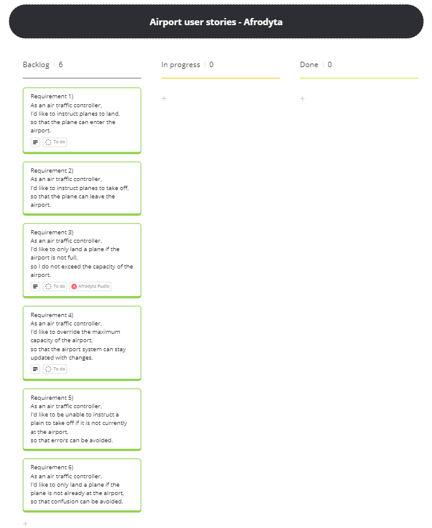
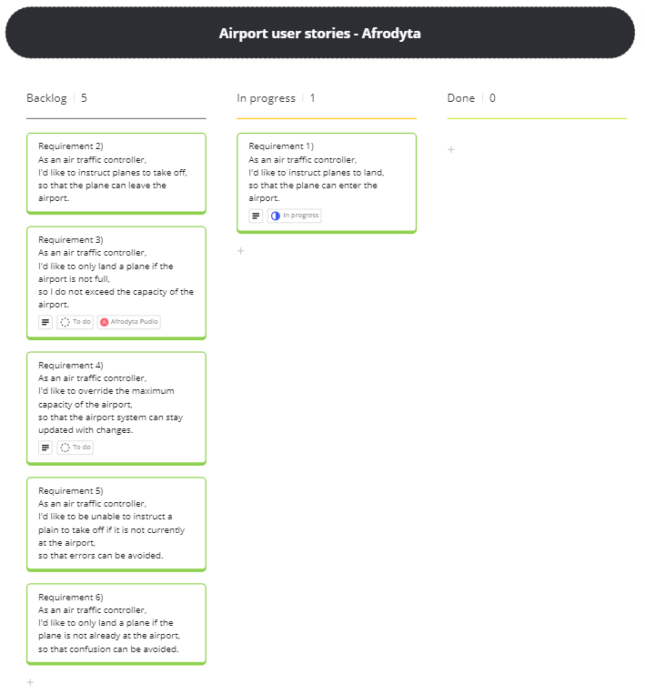
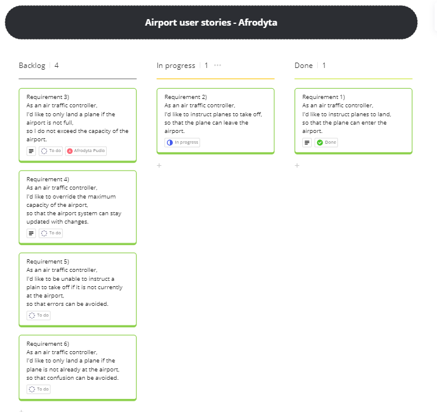
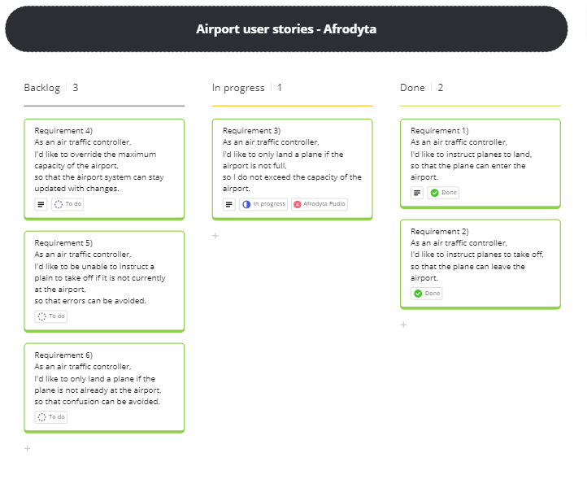
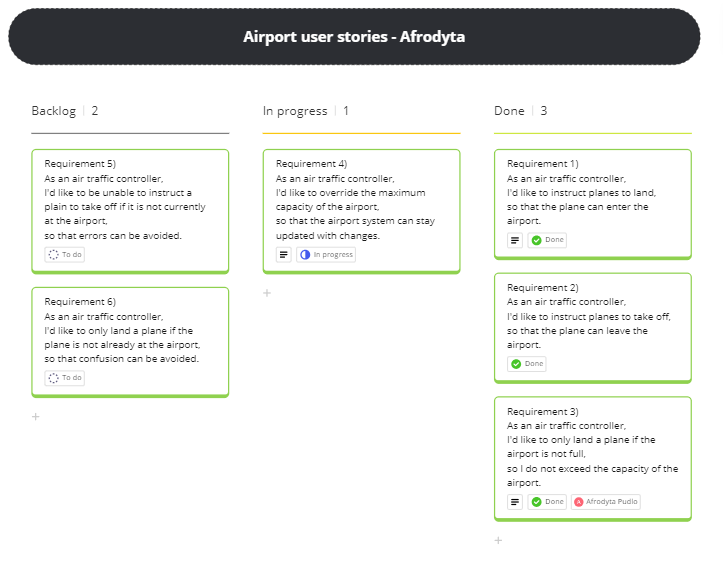
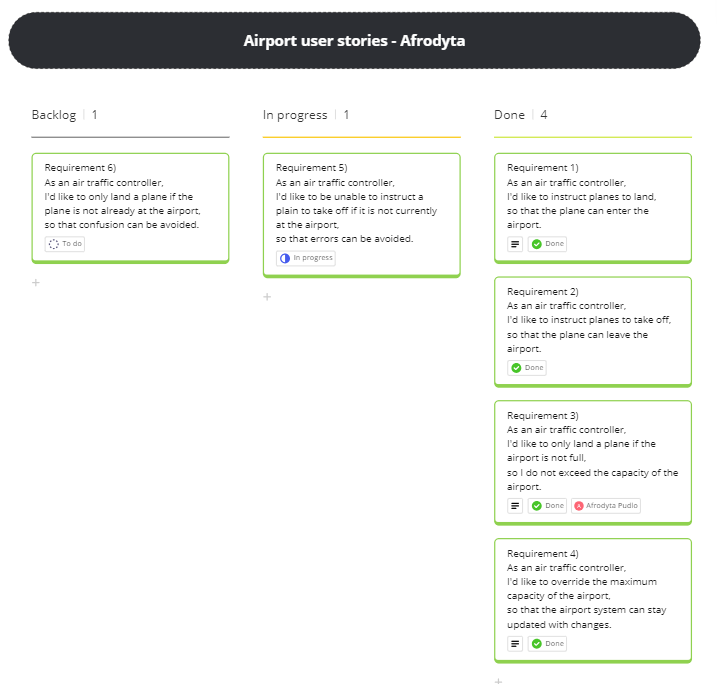
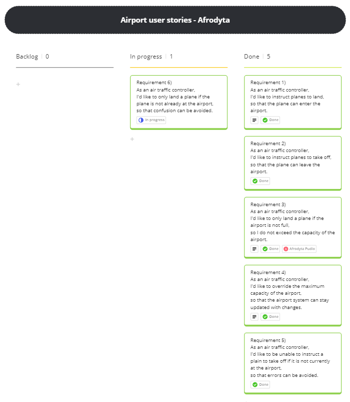
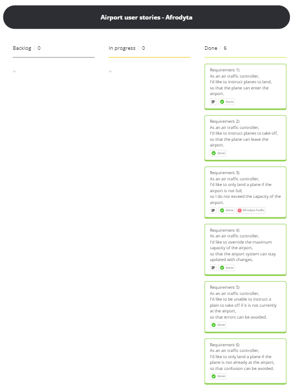
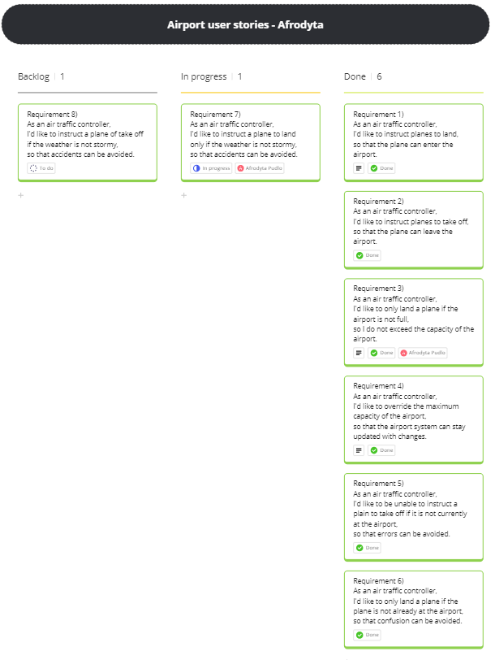

## Domain models
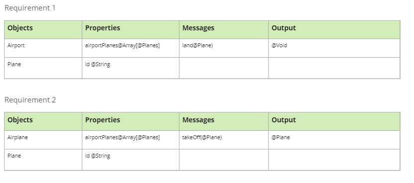
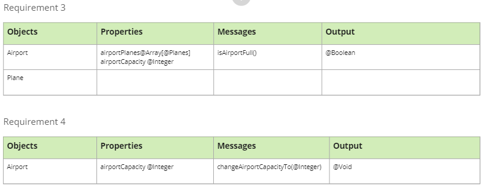
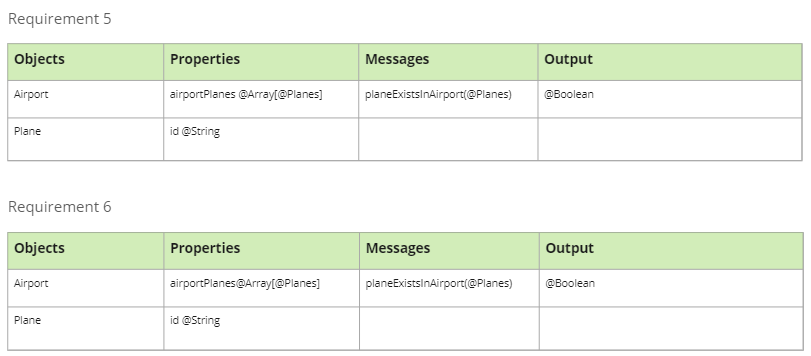
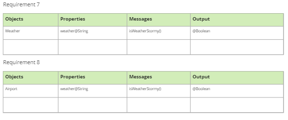

# Test Plan 

## Test Plan: Airport Functionality 

**Objective**: Validate the functionality of landing and taking off planes from the airport in console-based software solution. 

**Scope**: The test plan covers the following scenarios: 

- The software will define have a defined maximum capacity of the number of planes. 

- The maximum capacity can the overridden. 

- Landing a plane in the airport only if the airport is not full and the plane is not already at the airport. 

- Plane taking off from an airport as long as it is already at the airport  

- Planes must not be able to land if the weather is stormy. 

- Planes must not be able to take off if the weather is stormy. 

### Testing Strategies: 

Unit Testing: Test the individual functions responsible for landing in not stormy weather and in an airport that is not full, take off of planes when the weather is not stormy, overriding maximum airport capacity. 

Regression Testing: Ensure that existing functionality is not affected by changes or updates to the airport software. 

### Testing Resources: 

Testing Tools: Use of a self-developed test framework for performing unit testing and regression testing. 

#### Test Cases:  Landing a plane airport: 

- Test Case 1: Verify that users can land a single plane in the airport. 

- Test Case 2: Verify that the plane that landed is the actual plane added to the airport. 

#### Test Cases:  Take off a plane from an airport: 

- Test Case 3: Verify that users can take off a single plane in the airport.  

- Test Case 4: Verify that the plane that take off is the actual plane removed from the airport. 

#### Test Cases:  Defining Maximum Capacity  

- Test Case5: Verify that the airport is not at maximum capacity of plane in airportPlanes array when airport is empty. 

- Test Case 6: Verify that the airport is not at maximum capacity of plane in airportPlanes array airport is partially full. 

- Test Case 7: Verify that the airport is at maximum capacity of plane in airportPlanes array when airport is full. 

#### Test Cases:  Overriding Maximum Capacity  

- Test Case 8: Verify that the maximum capacity of the airport can be increased. 

- Test Case 9: Verify that the maximum capacity of the airport can be set to 0. 

- Test Case 10: Verify that the maximum capacity of airport cannot be set to a negative integer 

#### Test Cases: Land a plane if the plane is not currently present at the airport.  

- Test Case 11: Verify that a specific plane is in the airport. 

- Test Case 12: Verify that a specific plane is not in the airport. 

- Test Case 13: Verify that only planes that are not present can be added with land(). 

#### Test Cases: Land a plane if the plane is the airport is not currently full. 

- Test Case 14: Verify that if a specific plane is in the airport when the airport is not full. 

- Test Case 15: Verify that plane has an ID before it is added to the airportPlanes array. 

#### Test Cases: Verify a plane will not land if the weather is Stormy.  

- Test Case 16: Verify that isStormy returns a boolean depending on weather condition. 

- Test Case 17: Verify that isStormy returns a true value randomly 

- Test Case 18: Verify that isStormy returns a false value randomly. 
  
## Copilot - Code suggestion

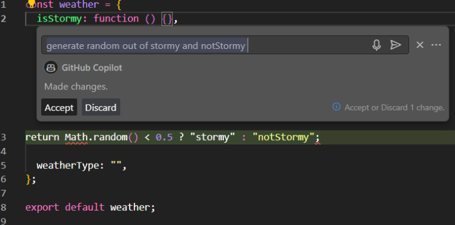
